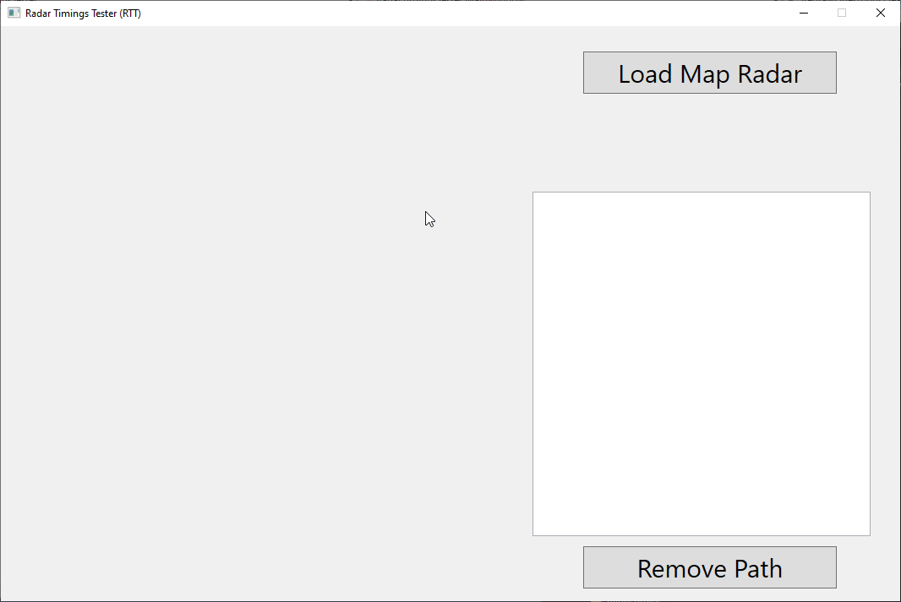

# Radar-Timing-Tester RTT

This is a very simple tool that lets you draw on a CSGO radar image to get a mostly accurate idea of how long it would take to walk there. Currently it assumes with a knife, however this could be changed to allow any weapon type in the future.

This is currently an early build. If you have comments or suggestions I am open to adding features as required.

Download: [Latest](https://github.com/7ark/Radar-Timing-Tester/releases/latest)

Troubleshooting Guide:

- I uploaded a photo but got a warning that it couldn't find a .txt associated with the radar

Currently RTT will automatically try to find your .txt radar data from the image you give it. I will probably allow you to manually select this in the future, but for the time being I suggest only selecting pngs from your resources/overviews folder, so that the tool can automatically find your file.

Planned Updates
- Add another drawing mode 'Waypoint' where you can click in several spots instead of a constant drawing freehand. Need to figure out the best way to handle this in the interface.
- Add a setting to display the current loaded radar .txt, and be able to change it in case theres a specific issue attempting to auto-locate it.
- Add option to select a line and then change its color dynamically.
